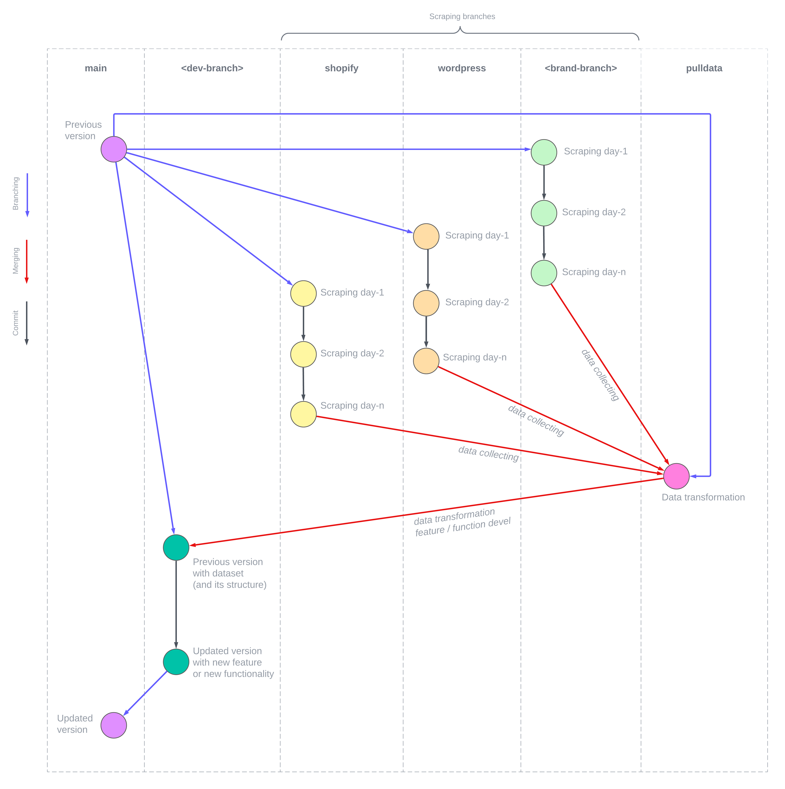

# Momoshop Pilot Project: Data Retrieval

The aim of this pilot project is to gather historical pricing data (currently limited for clothing, fashion & beauty products), enabling shoppers to make timely consumer purchase decisions and provide alerts for the optimal buying moments for the wishlist, the one that truly desires to be emptied. By delving into past trends and patterns, valuable insights into “real” pricing can be gained to avoid marketing gimmicks.

For the retailers and suppliers, the market's response to product pricing will then serve as a basis for informed business decisions and the customization of marketing strategies that deeply resonate with the target audience while providing attentiveness.

Furthermore, the collected data will assist to identify potential market risks and opportunities, enabling marketer to stay one step ahead of the competition and adapt to ever-changing consumer needs and desires.

### Data providers

The necessary data for this project is obtained from various online retailers, marketplaces, and e-commerce platforms, which offer a wealth of valuable insights into product pricing and inventory.

### Methods

Patterns and preferences of the trends are uncovered through the analysis of historical pricing from these sources. This information aids in making informed decisions about consumer purchase timing and determining affordable and acceptable pricing boundaries.

The comprehensive approach ensures that data collection processes are diverse and representative of the broader market, ultimately enhancing the accuracy and reliability of our findings.

By leveraging pricing history and comprehending retailers' discount strategies, consumers can shop smarter, making informed decisions, and boosting confidence in navigating the market for an improved shopping experience overall.

### Development

**Tools**

Data collecting is proceed using Scrapy's spider/crawler (Scrapy project momo), and various scraping tool as follows:

- Shopify scraper | [repo](https://github.com/akherlan/shopify)
- Woocommerce scraper | [repo](https://github.com/akherlan/woocommerce)
- Shopee API wrapper | [repo](https://github.com/akherlan/onlineshop)

**Role model**

- <https://www.jellibeans.com>
- <https://www.shopstyle.com>

**Current development workflow**

